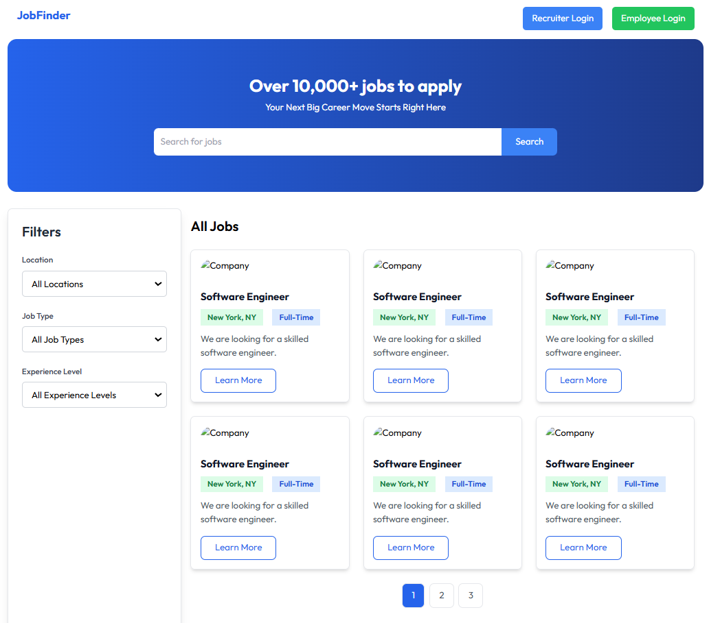
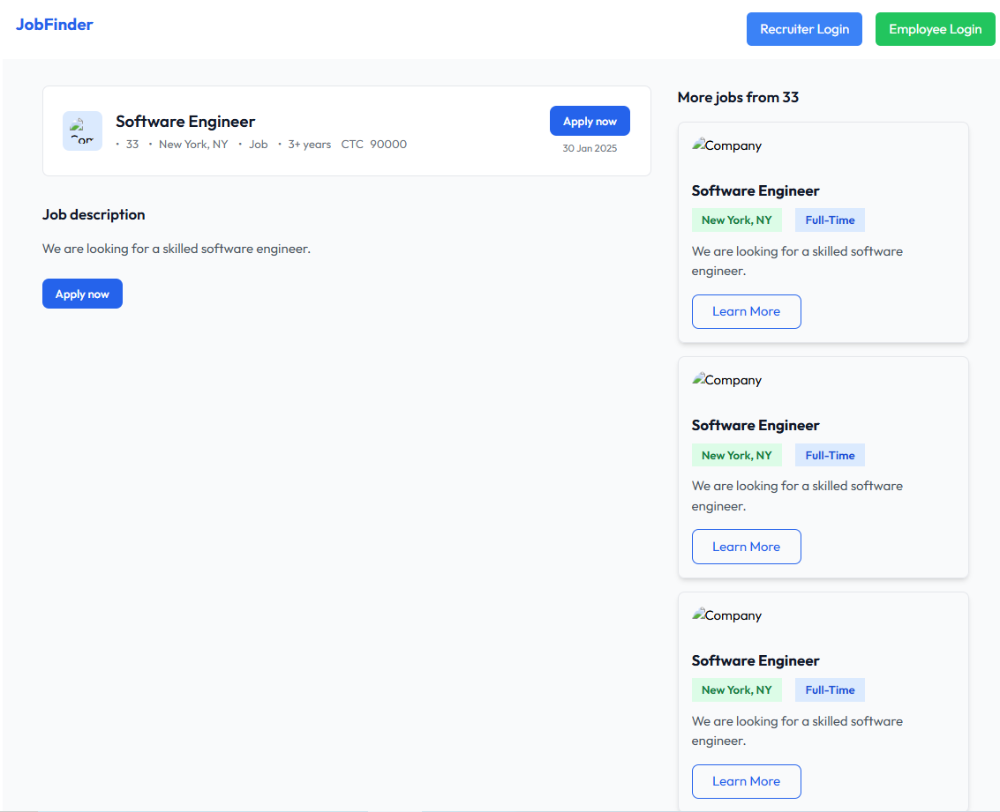
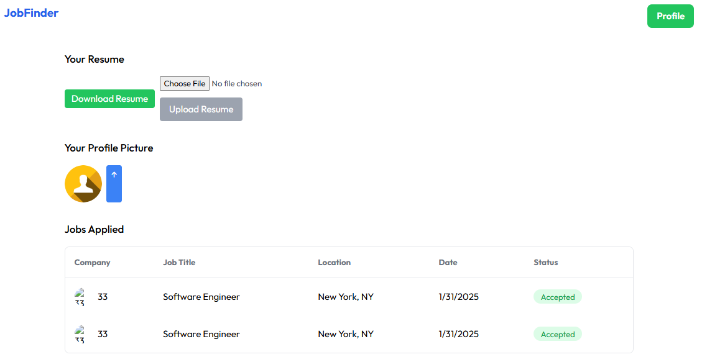
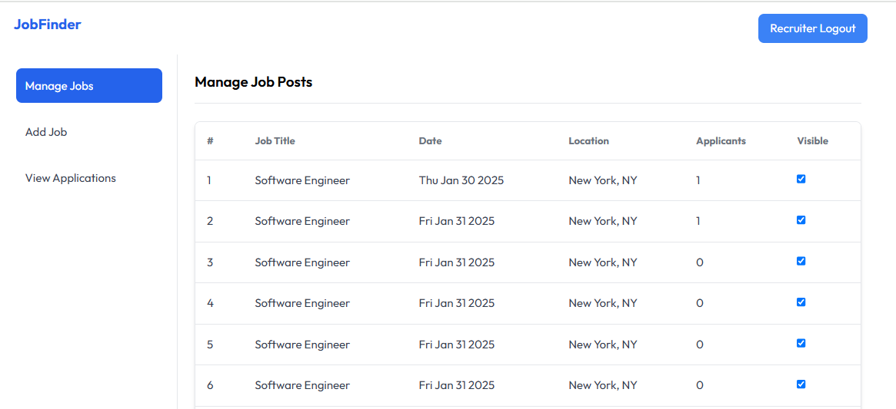
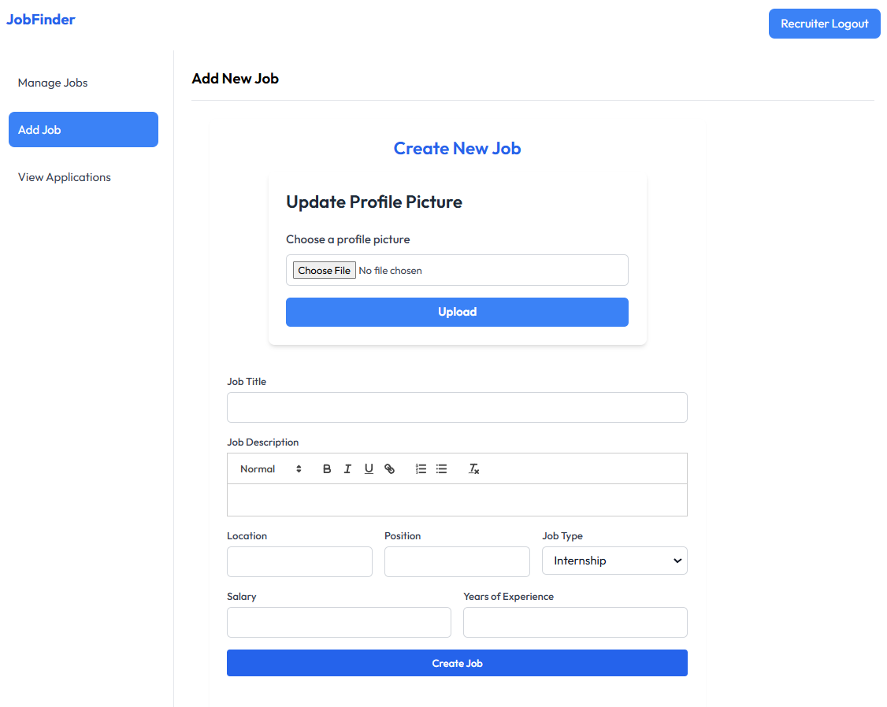
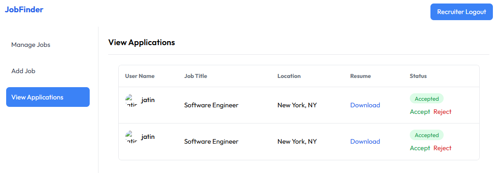

# JobFinder

**JobFinder** is a job board application that connects employers with job seekers. The app provides job listings with search and filter options, job application management, and a dedicated dashboard for both employers and employees. 
Employers can manage job listings and recieved applicant, while employees can apply to jobs, track their applications, and manage their profiles.

---

## Key Features

### Job Seeker (Employee) Features
- **Job Search**: Employees can search for jobs using keywords and filters based on experience level, job type, and location.
- **Job Listings**: View a list of available jobs with company name, logo, location, experience level required, and job type.
- **Job Details**: Clicking on a job listing shows detailed information such as company image, CTC (cost to company), location, experience level, job type, and the date the job was posted.
- **Apply for Jobs**: Employees can apply for jobs by sending their resume to the employer through the platform.
- **Application Dashboard**: Employees can view all their applications in one place, including company details, location, date of application, and the status of each application.

### Employer Features
- **Employer Dashboard**: Employers have access to a dashboard where they can manage their job listings, view applicants, and download resumes.
- **Add Job Listings**: Employers can add new job listings with company images and relevant job details. 
- **Job Management**: Employers can toggle the visibility of jobs and manage whether they are visible to job seekers or not.
- **Applicant Management**: Employers can view applicants for their jobs, accept or reject applications, and download resumes.
- **Company Profile**: Employers can upload company logo.

---

## Technologies Used

### Frontend
- **React**: A JavaScript library for building user interfaces.
- **Tailwind CSS**: A utility-first CSS framework for designing responsive and modern user interfaces.
- **React Toastify**: For displaying toast notifications to inform users about actions like job application success or errors.
- **React Router**: For navigation between different views such as job listings, job details, dashboards, etc.

### Backend
- **Node.js**: A JavaScript runtime for building the backend API.
- **Express.js**: A web framework for Node.js that handles routing and middleware for API endpoints.
- **Multer**: A middleware for handling file uploads, allowing users and employers to upload resumes and company logos.
- **Cloudinary**: For storing and serving images such as company logos and user profile pictures.
- **JWT Authentication**: JSON Web Tokens (JWT) for user authentication and authorization, providing secure login and access control for employees and employers.

### Database
- **MongoDB**: A NoSQL database to store user data, job listings, and application records.

---

## How to Run Locally

1. **Clone the Repository**
    ```bash
    git clone https://github.com/your-username/JobFinder.git
    cd JobFinder
    ```

2. **Install Dependencies**
    - **Backend**:
      ```bash
      cd backend
      npm install
      ```
    - **Frontend**:
      ```bash
      cd frontend
      npm install
      ```

3. **Configure Environment**

    Create a `.env` file in the **backend** directory:
    ```env
    MONGO_URI=mongodb+srv://<username>:<password>@cluster.mongodb.net/JobFinder
    JWT_SECRET=your_secret_key
    CLOUDINARY_URL=your_cloudinary_url
    ```

4. **Run the Application**
    - **Backend**:
      ```bash
      cd backend
      npm start
      ```
    - **Frontend**:
      ```bash
      cd frontend
      npm run dev
      ```

---

## Project Highlights

### Job Search & Filters
- **Advanced Job Search**: Users can search for jobs by keywords and filter the results by experience level, job type, and location.
- **Pagination**: Job listings are paginated for a smoother user experience, allowing job seekers to browse through results efficiently.

### Job Details Page
- **Job Information**: Clicking on a job listing shows detailed information such as company logo, CTC (cost to company), location, experience level, job type, and the date posted.
- **Apply Button**: Employees can apply for jobs by submitting their resume and profile picture, which are stored in the database and sent to the employer.

### Employee Dashboard
- **View Applications**: Employees can view the status of their job applications, including company details, date of application, and current application status (e.g., pending, accepted, rejected).
- **Manage Profile**: Employees can update their profile, including uploading their resume and profile picture.

### Employer Dashboard
- **Job Management**: Employers can create new job listings, edit existing ones, and control the visibility of job postings.
- **Applicant Management**: Employers can view and manage applications, accepting or rejecting candidates, and download resumes.
- **Company Profile**: Employers can upload and manage their company logo and details for a more personalized experience.

---

## Skills Demonstrated

- **Full-stack Development**: Built both the frontend and backend, providing a complete solution for job seekers and employers.
- **File Upload Management**: Used **Multer** to handle resume uploads and **Cloudinary** for storing company logos and profile pictures.
- **Responsive Web Design**: Designed a responsive and modern UI with **Tailwind CSS**.
- **User Authentication**: Integrated **JWT authentication** for secure login and user management, with different roles (employee, employer).
- **RESTful API Design**: Designed RESTful APIs to manage jobs, applications, and user profiles.
- **Job Application Flow**: Created a job application process where employees submit their resumes, which employers can view and manage.
- **Pagination**: Implemented pagination for job listings to improve performance and user experience.

---

## Future Improvements
- **Job Recommendation System**: Introduce machine learning or algorithm-based job recommendations for users based on their profile and job history.
- **Messaging System**: Add a messaging feature for communication between employers and applicants.
- **Real-Time Updates**: Integrate real-time notifications (e.g., WebSockets) for job application status changes.
- **Admin Panel**: Add an admin panel for managing users, job listings, and job applications more efficiently.

---

## Screenshots

### Job Listings Page
This section displays the job listings page with search filters and pagination.

<div gap: 10px;">
    
</div>


### Job Details Page
This section shows the detailed view of a job with company info and apply option.

<div gap: 10px;">
    
</div>

### Employee Dashboard
This section displays the dashboard where employees can see their applications and update their profiles.

<div gap: 10px;">
    
</div>

### Employer Dashboard
This section shows the employer dashboard where employers can manage job listings and applicants.

<div gap: 10px;">
    
    
    
</div>

---

## Conclusion
**JobFinder** is a robust job board platform that bridges the gap between job seekers and employers. With features such as job search, filtering, job applications, and an employer dashboard, it provides a comprehensive solution for managing job listings and applications.
It’s an ideal project for showcasing skills related to full-stack develpoment ,authentication, file handling, and RESTful APIs.

---

Feel free to adjust the above template with your specific details, including any additional features, instructions, or modifications you have made.
